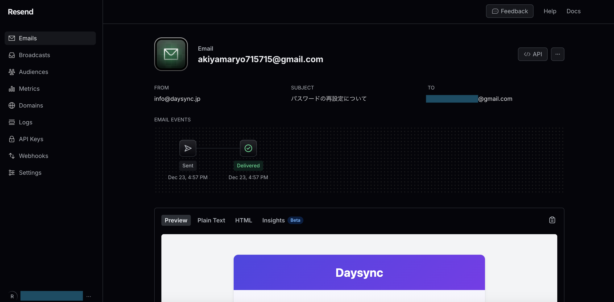

# DaySyncApp - あなたの毎日をよりスマートに

**未経験からWebエンジニアへのポートフォリオ**

このポートフォリオは、未経験からWebエンジニアを目指す私の、これまでの学習成果を示すものです。アプリケーション「DaySyncApp」は、日々の業務を効率化するための多機能Webアプリケーションです。

## 🚀 開発の背景
DaySyncAppは、日報管理、ユーザー管理、コメント機能、メンション機能などを備えた、チームでの情報共有を促進するアプリケーションです。社内での業務報告ツールの不在により、重要な情報や知見が適切に共有・蓄積されていないという課題に直面していました。この問題を解決するため、チームメンバー全員が簡単に日報を作成・共有し、円滑なコミュニケーションを取れるプラットフォームとしてDaySyncAppを開発しました。

  

## 🛠️ インフラストラクチャ

* **デプロイ環境**:
  * **fly.io**: グローバルに分散されたアプリケーションプラットフォーム
    * CLI上での簡単なデプロイ
    * 東京リージョンがあることで、ユーザーのアクセス速度が速い。
    * 自動スケールかつ従量課金制
  * **Cloudflare**: フルプロキシモードでのセキュリティ強化
    * DDoS保護
    * WAF（Web Application Firewall）による保護
    * SSL/TLS暗号化
    * CDNによるパフォーマンス最適化

## 🛠️ 技術スタック

このプロジェクトでは、以下の技術を使用しました。

*   **フロントエンド**:
    *   **JavaScript**: 動的なユーザーインターフェースを実現
    *   **React**: メール送信に関してコンポーネントベースで効率的な開発
        * `day_sync_app/app/javascript/emails/password_reset.jsx`
    *   **Tailwind CSS**: ユーティリティファーストで迅速なスタイリング
        * `day_sync_app/app/assets/stylesheets/home.css`
*   **バックエンド**:
    *   **Ruby on Rails**: MVCアーキテクチャに基づく効率的な開発
        * `day_sync_app/config/application.rb`
    *   **PostgreSQL**: 信頼性の高いデータ管理
        * `day_sync_app/config/database.yml`
*   **その他**:
    *   **Resend**: メール送信サービスの利用
        * `day_sync_app/app/mailers/devise_mailer.rb`
    *   **Turbo**: SPAのような快適な操作性
        * `day_sync_app/app/javascript/search_panel.js`
    *   **Kaminari**: ページネーションの実装
        * `day_sync_app/app/views/kaminari/_page.html.erb`
    *   **marked.js**: マークダウンのリアルタイムプレビュー
        * `day_sync_app/app/javascript/controllers/markdown_preview_controller.js`
    *   **Node.js**: メールテンプレートのレンダリング
        * `day_sync_app/scripts/render_email.js`

## 🔍 デモアカウント

以下のアカウントで[DaySyncApp](https://daysync.jp/)にログインすると、実際の機能や技術記事をご覧いただけます：

* **メールアドレス**: test@example.com
* **パスワード**: testtest

各機能の詳細な実装方法や技術的な解説は、埋め込みリンクからログイン後の記事でご確認いただけます。

## ✨ 主な機能

*   **日報管理**:
    *   Markdown形式での日報作成・編集機能
        * `day_sync_app/app/views/reports/_form.html.erb`
    *   作成日、タイトル、内容での日報検索機能
        * `day_sync_app/app/views/reports/_search_panel.html.erb`
    *   日報内容でのURLによるリンク遷移機能
        * `day_sync_app/app/views/reports/show.html.erb`

  

  

*   **ユーザー管理**:
    *   新規登録、ログイン、ログアウト機能 (Deviseを使用)
    *   プロフィール編集機能
        * `day_sync_app/app/views/devise/registrations/_profile_fields.html.erb`
*   **コメント機能**:
    *   日報へのコメント投稿・削除機能
        * `day_sync_app/app/views/shared/comments.html.erb`

  

*   [**メンション機能**:](https://daysync.jp/reports/16)
    *   日報内で他の日報を参照するメンション機能
        * `day_sync_app/app/models/report.rb`
        * `day_sync_app/app/views/reports/_mentions.html.erb`

  

## 💪 工夫した点

*   [**インフラストラクチャ設計**:](https://daysync.jp/reports/14)
      * fly.ioとCloudflareの組み合わせによるコストとパフォーマンスを意識したインフラ構築

*   [**視覚的な情報設計**:](https://daysync.jp/reports/9)
      * Tailwind CSSを活用し、クリーンで見やすいUIを実装しました。特に、レスポンシブデザインに対応し、様々なデバイスで快適に利用できる点に注力しました。
      * バリデーションエラー時のフォーム表示にもTailwindのユーティリティクラスを活用し、エラー箇所を視覚的に分かりやすく表現しました。
        * `day_sync_app/config/application.rb`
        * `day_sync_app/app/views/shared/_validation_errors.html.erb`

  

*   [**メール送信機能**:](https://daysync.jp/reports/10)
      * Resend APIを利用し、パスワードリセットのメール送信機能を実装しました。
      * React Emailを使用することで効率的なメールテンプレートの作成を可能にしました。
        * `day_sync_app/app/mailers/devise_mailer.rb`

  

  

*   [**検索機能**:](https://daysync.jp/reports/15)
      * Ransackを使用し、日報のタイトルや内容による検索機能に加えて、ユーザーによる検索も実装しました。
      * turbo_frameを活用し、検索結果をページ遷移せずに表示することで、ユーザーにとって快適な操作感を実現しました。
        * `day_sync_app/app/models/report.rb`

  

*   [**マークダウン機能**:](https://daysync.jp/reports/11)
      * CommonMarkerとmarkedライブラリを活用し、安全で高機能なマークダウンパーサーを実装しました。
      * 独自の拡張機能として、タスクリストと詳細表示（details）機能をサポートしています。
      * リアルタイムプレビュー機能により、編集中の表示確認が即座に可能です。
      * XSS対策としてサニタイズ処理を実装し、セキュアな運用を確保しています。
        * `day_sync_app/app/helpers/markdown_helper.rb`
        * `day_sync_app/app/javascript/controllers/markdown_preview_controller.js`

  

## 🌱 今後の展望

*   **バッチ処理でのメール送信**: メール送信をバッチ処理で実装することで、自動でユーザーへの利用促進を促す。
*   **通知機能の追加**: メンションやコメントがあった際に通知を受け取れるようにする。
*   **UI/UXの継続的な改善**: ユーザーからのフィードバックを元に、Reactを使用してより使いやすいインターフェースを目指す。

##   📄ER図

  

## ✉️ お問い合わせ

ご質問やフィードバックがありましたら、お気軽にご連絡ください。

ryo.akiyama112345@gmail.com

**最後までご覧いただき、ありがとうございました！**
